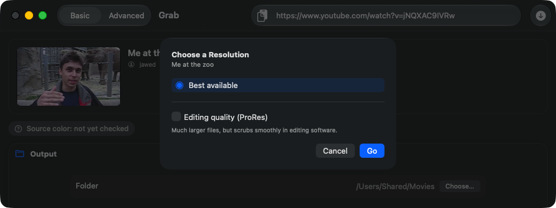
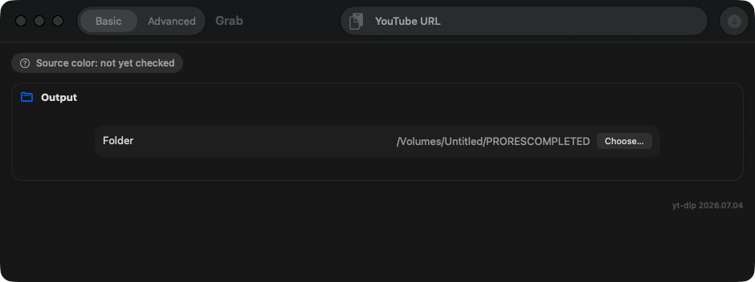
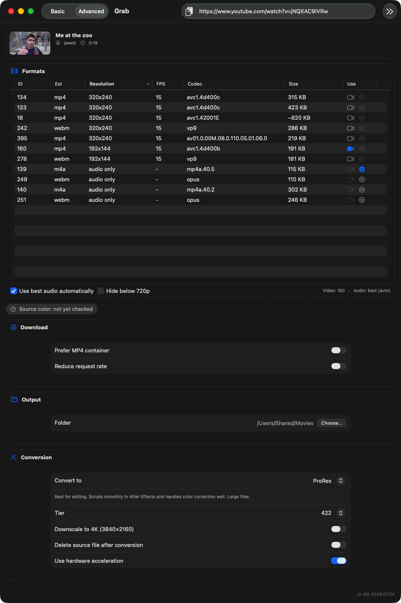

# Grab

A native macOS app that wraps [`yt-dlp`](https://github.com/yt-dlp/yt-dlp) and
[`ffmpeg`](https://ffmpeg.org) to download YouTube video and, optionally,
convert it to ProRes (with automatic HDR tone-mapping, for After Effects and
other editing software) or a smaller H.264 MP4.

<p align="center">
  
</p>

- **Basic mode** (the default): paste a link, pick a resolution, done — Grab
  always picks a format that actually opens in QuickTime, converting to
  H.264 behind the scenes if it has to
- **Advanced mode**: the full format table, per-track video/audio selection,
  and every conversion option, for when you want manual control
- **Playlists**: paste a playlist (or a video link with a playlist attached)
  to get a checklist of videos and a sequential download queue, with
  progress/retry/cancel per item
- Optional ProRes conversion (Proxy/LT/422/HQ/4444) or H.264, with hardware
  acceleration when available and automatic HDR → SDR tone-mapping
- Shows the fetched video's title/thumbnail/duration/channel so you can
  confirm it found the right video before downloading
- Progress bar with ETA for both the download and conversion phases
- A completion notification with a "Reveal in Finder" action
- Cookie-based auth (via your browser's cookie store) for private/age-gated
  videos — Grab never asks for or handles your Google credentials directly
- Automatic in-app update checking (via [Sparkle](https://sparkle-project.org)) —
  see [Updating](#updating)

Grab is a personal tool, unsigned and distributed ad-hoc (no Apple Developer
ID). See [Installing](#installing) below for the one-time step macOS requires
before it'll run.

## Requirements

- macOS 14 (Sonoma) or later, Intel or Apple Silicon
- [Homebrew](https://brew.sh), with `yt-dlp` and `ffmpeg` installed:

  ```sh
  brew install yt-dlp ffmpeg
  ```

Grab looks for these in both standard Homebrew locations
(`/opt/homebrew/bin` on Apple Silicon, `/usr/local/bin` on Intel) — it
doesn't rely on your shell's `PATH`, since GUI apps don't inherit it. If
either tool isn't found, Grab tells you and gives you the exact `brew
install` command to run.

## Installing

1. Download the latest `Grab-x.y.z.dmg` from
   [Releases](../../releases).
2. Open the DMG and drag `Grab.app` into `Applications`.
3. **First launch will be blocked by Gatekeeper** — macOS doesn't recognize
   the developer because this build isn't signed with a paid Apple Developer
   ID or notarized. That's expected. To get past it, either:

   - **System Settings**: try to open Grab (it'll be blocked), then go to
     *System Settings → Privacy & Security*, scroll down, and click
     **Open Anyway** next to the mention of Grab. Confirm in the follow-up
     dialog. (On older macOS versions, right-click → Open may offer the same
     bypass directly — Apple has been tightening this over time, so which
     one you see depends on your macOS version.)
   - **Terminal** (always works, one time only): strip the quarantine flag
     macOS attaches to anything downloaded from a browser, then open it
     normally:

     ```sh
     xattr -rc /Applications/Grab.app
     ```

     (If you have a `pip`-installed `xattr` shadowing the system one, use
     `/usr/bin/xattr -rc /Applications/Grab.app` explicitly — the Python
     version doesn't support `-r`.)

You only need to do this once per install; subsequent launches of that same
version are normal. (Updating to a new version installs a fresh, newly
downloaded copy of the app — see the Gatekeeper note under
[Updating](#updating) below for why the bypass isn't a total one-time thing.)

## Usage

### Basic mode (default)

1. Paste a YouTube URL and click **Download** (or hit Return).
2. Pick a resolution — only ones that actually exist for that video are
   shown, plus an always-available "Best available." Optionally turn on
   "Editing quality (ProRes)" and pick a tier.
3. Click **Go**. Grab always produces a file that opens in QuickTime — if
   the chosen quality only exists in a codec QuickTime can't play, Grab
   converts to H.264 automatically rather than handing you an unplayable
   file.
4. Find your file via the "Reveal in Finder" button or notification action
   when it's done.

<p align="center">
  
</p>

### Advanced mode

Switch to **Advanced** in the toolbar for the full format table: pick a
specific video/audio format (or click **Best Quality**), choose ProRes or
H.264 conversion and a tier/quality manually, then **Download**.

<p align="center">
  
</p>

### Playlists

Paste a playlist link, or a video link that also has a playlist attached —
Grab asks (or, per your Settings default, decides automatically) whether
you meant just that video or the whole playlist. Picking the playlist opens
a checklist of every video (pre-checked) plus a format-quality cap for the
whole batch; **Add to Queue** processes them one at a time, with per-item
progress, retry, and cancel. The queue persists across quits — a job that
was mid-download when Grab closed shows back up as "queued," not lost.

Cookie-based auth, sleep interval, MP4 preference, playlist-prompt default,
and other advanced options are under the app's Settings (⌘,).

## Updating

Grab checks for updates automatically in the background on launch, and you
can trigger a manual check any time from the **Grab → Check for Updates…**
menu item. When a new version is available, Grab shows the release notes
and offers to download and install it — no need to come back here and
download the DMG by hand.

**You'll still see Gatekeeper's block on each update**, the same as on
first install (see [Installing](#installing) above) — Grab is unsigned/
ad-hoc, so every newly downloaded version is freshly quarantined by macOS,
regardless of how it got onto your Mac. This is expected, not a bug in the
updater. If Gatekeeper blocks the update after Sparkle installs it, use the
same *System Settings → Privacy & Security → Open Anyway* step (or the
`xattr -rc` Terminal command) from Installing, applied to the newly
updated `/Applications/Grab.app`.

Update downloads are cryptographically signed (Sparkle's EdDSA signing,
independent of and in addition to Gatekeeper) — Grab verifies that
signature before installing anything, so a corrupted or tampered download
is rejected automatically rather than silently installed.

## Building from source

Requires [XcodeGen](https://github.com/yonaskolb/XcodeGen) and a full Xcode
install (Command Line Tools alone can't build this target). The first build
needs network access to resolve the Sparkle Swift Package dependency
(cached by Xcode/SwiftPM after that):

```sh
xcodegen generate
xcodebuild -project Grab.xcodeproj -scheme Grab -configuration Release \
  -destination 'platform=macOS' build
```

Or use the packaging script, which does the above and produces a DMG under
`build/`:

```sh
./scripts/release.sh
```

## License

MIT — see [LICENSE](LICENSE).
